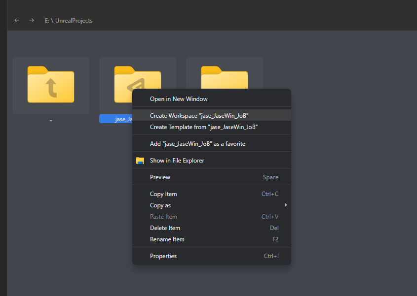
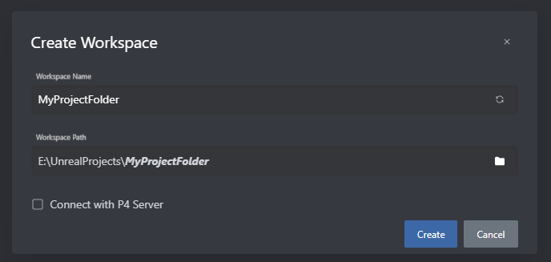
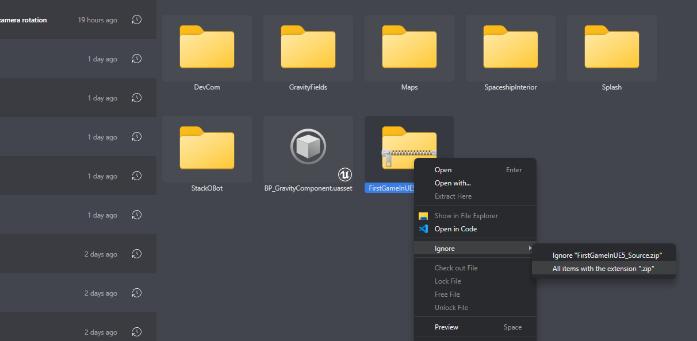
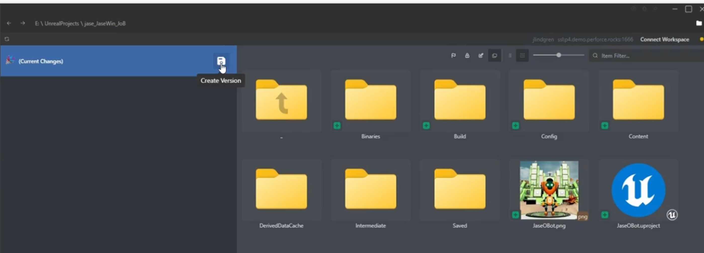
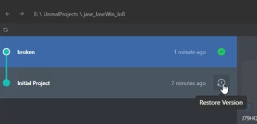
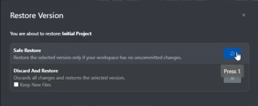

# \[Free & Fast\] P4 One for Solo Version Control: A Step-by-Step Guide

Using version control while prototyping, experimenting, or participating in Game Jams can save you a LOT of time and frustration while freeing you up to try new things without fear. Perforce's new [P4 One](https://www.perforce.com/products/helix-core/p4-one) is a super easy, fast, and free way to get powerful version control for your solo projects.

### Prefer video? Watch here:
<iframe width="560" height="315" src="https://www.youtube.com/embed/_okdTvFEoHo?si=NuH7JsmQEuI-UaSE" title="YouTube video player" frameborder="0" allow="accelerometer; autoplay; clipboard-write; encrypted-media; gyroscope; picture-in-picture; web-share" referrerpolicy="strict-origin-when-cross-origin" allowfullscreen></iframe>

## 1. Downloading and Installing P4 One

To get started, head to the [P4 One page at Perforce.com](https://www.perforce.com/products/helix-core/p4-one) and click to download.

Choose your operating system—Windows or Mac OS—and fill out your information to get the download.

After downloading and running the installer, you'll open P4 One and get started with a blank setup. Just agree to the terms, and you're ready to move on.

## 2. Creating a Workspace

With P4 One, setting up local version control is exceptionally simple. Navigate to ‘Volumes’ to locate your project.

For example, my project folder is `E:\UnrealProjects\jase_JaseWin_JoB` 

Just right-click your project's root folder and choose “Create workspace.”



If you're working solo, you don't need to connect to a P4 server.



## 3. Ignore Unnecessary Files

It's crucial to ignore folders that shouldn't be included in version control. The simplest way is to use this preconfigured [.p4oneconfig.yaml file](https://gist.github.com/jase-perf/51b15a0b24d9e0b20495d720445d3c06):

[](https://gist.github.com/jase-perf/51b15a0b24d9e0b20495d720445d3c06)

Just download the file and place it in the root of your workspace. This will ignore key directories like 'DerivedDataCache,' 'Intermediate,' and 'Saved.' 

You can also ignore specific files or file extensions from within P4One.  Right-click each one in P4 One and set them to be ignored. This will automatically add a line to your `.p4oneconfig.yaml` file or create one if it doesn't exist.


However, we can do a lot more by editing the `.p4oneconfig.yaml` file directly.

This is the basic template for the file in `yaml` format:

```yaml
ignore:
  items:
    - <Lines for each file path to ignore>
  pattern_matching: p4oneignore
```

### Basic Syntax Rules

#### Comments
Lines starting with `#` are comments and are ignored:
```yaml
# This is a comment
# Use comments to organize your ignore patterns
```

#### Simple File Names
To ignore a specific file name anywhere in your project:
```yaml
    - '**/filename.txt'
```
This ignores any file named `filename.txt` no matter where it is.

#### File Extensions
To ignore all files with a certain extension:
```yaml
    - '**/*.tmp'
```
This ignores all `.tmp` files anywhere in your project.

#### Folders
To ignore entire folders:
```yaml
    - '**/FolderName/**'
```
This ignores the folder `FolderName` and everything inside it, wherever it appears.

### Example patterns:

| Pattern | What it ignores | Example matches |
|---------|----------------|-----------------|
| `'**/*.tmp'` | All temporary files | `cache.tmp`, `MyProject/temp.tmp` |
| `'**/Saved/**'` | Saved folders and contents | `Saved/`, `MyProject/Saved/config.ini` |
| `'**/*-Debug.*'` | Files with "-Debug" in name | `Game-Debug.exe`, `MyApp-Debug.dll` |
| `'**/.DS_Store'` | Mac system files | `.DS_Store` anywhere |
| `'**/obj/**'` | Build output folders | `obj/`, `MyProject/obj/build.log` |

### Why Use `**/` at the Start?

Always start patterns with `**/` because:
- Your project might be inside other folders
- Other people might organize their workspace differently
- It ensures the pattern works regardless of folder structure

**Example:** If you just write `Saved/**`, it only matches a `Saved` folder at the very top level. But `'**/Saved/**'` matches `Saved` folders anywhere.
In order to ignore everything inside those folders, open the `.p4oneconfig.yaml` file which was just created at the workspace's root, and open it up in a text editor. Add `/**` to the end of each line so it looks similar to this: 


**Be sure those ignored folders no longer have a + icon on them to know if the Ignore is working correctly.**

## 4. Create an Initial Version

With everything set up, hit “Create version” to initialize your repository. You might name it “Initial Submit” or something similar for easy reference.



Create a version by clicking the disk icon

## 5. Versioning with P4 One

P4 One continually monitors changes and detects edits to your files automatically. Whenever you tweak something, hit "Create version" to save the state and add a descriptive note, allowing you to track your progress effectively.

### 6. Rolling Back to a Previous Version

Mistakes happen, but with version control, they’re easily fixable. If you break something or just want to go back to how everything was before, just close Unreal, select a version you'd like to return to, and click "Restore version."

Create a new version first before restoring an older version to ensure nothing's lost.



As long as you have created a new version to save your current state, you can select Safe Restore to restore all files to their previous state without risk of losing your work.



By continually creating versions, experimenting with new ideas, and making adjustments, you can comfortably manage and roll-back changes without hassle.